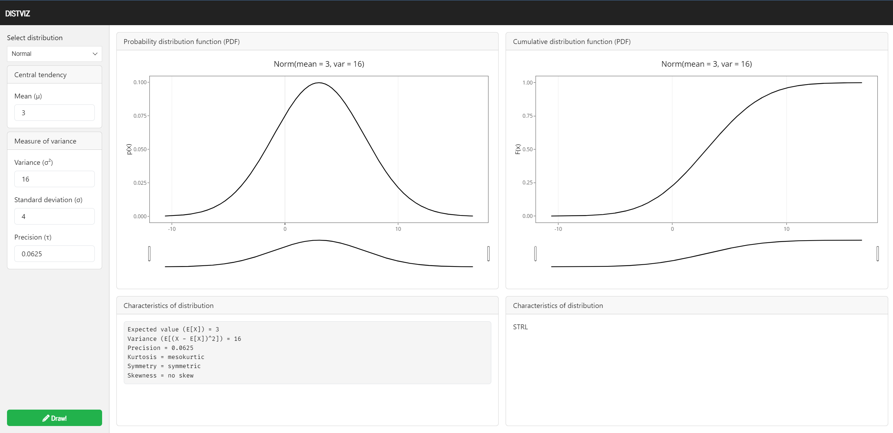

<!-- README.md is generated from README.Rmd. Please edit that file -->

```{r, eval = FALSE, include = FALSE}
rmarkdown::render(input = "README.Rmd", output_options = list(html_preview = FALSE))
```

```{r, include = FALSE}
knitr::opts_chunk$set(
  collapse = TRUE,
  comment = "#>"
)
```

# distrviz

<!-- badges: start -->
<!-- badges: end -->

The goal of distrviz is to vizualize (hopefully) every distribution that is 
available in the [`{distr6}`](https://github.com/xoopR/distr6) package.



The main features are:

 - Support both **discrete** and **continuous** random variables (RV)
 - Interactive chart of **probability distribution function (PDF)**
  - Densities for continuous RV, histograms for discrete RV
 - Interactive of **cummulative distribution function (CDF)**
 - **Dynamic recalculation** of parameters
  - For example, changing the *variance* of a normal distributions update's
    the standard deviation and precision.
 - Basich characteristics

The app can be seen live [here](https://distrviz-ctt2nrcxzq-ey.a.run.app/).
Note that it may take longer time to load due to budgeting.

## Imlemented distributions

```{r include=F}
AVAILABLE_DISTRIBUTIONS <- c(
  "Normal" = "normal",
  "Student" = "studentt",
  "Beta" = "beta",
  "Noncentral Beta" = "betanoncentral",
  "ChiSquared" = "chisquared",
  "Noncentral ChiSquared" = "chisquarednoncentral",
  "Arcsine" = "arcsine",
  "Cauchy" = "cauchy",
  "Binomial" = "binomial",
  "Erlang" = "erlang",
  "Exponential" = "exponential",
  "F-Distribution" = "fdistribution",
  "Noncentral F-Distribution" = "fdistributionnoncentral",
  "Frechet" = "frechet",
  "Gamma" = "gamma",
  "Gompertz" = "gompertz",
  "Gumbel" = "gumbel",
  "Inverse Gamma" = "inversegamma",
  "Laplace" = "laplace",
  "Logistic" = "logistic",
  "Log-Logistic" = "loglogistic",
  "Log-Normal" = "lognormal",
  "Pareto" = "pareto",
  "Rayleigh" = "rayleigh",
  "Shifted Log-Logistic" = "shiftedloglogistic",
  "Noncentral Student" = "studenttnoncentral",
  "Triangular" = "triangular",
  "Weibull" = "weibull",
  "Wald" = "wald",
  "Uniform" = "uniform",
  "Poisson" = "poisson",
  "Negative Binomial" = "negativebinomial",
  "Bernoulli" = "bernoulli",
  "Logarithmic" = "logarithmic",
  "Geometric" = "geometric",
  "Hypergeometric" = "hypergeometric",
  "Degenerate" = "degenerate",
  "Discrete uniform" = "discreteuniform",
  "Weighted discrete" = "weighteddiscrete"
)
```

Currently, these distributions are supported.

```{r echo=F}
distr6::listDistributions() |> 
  dplyr::as_tibble() |> 
  dplyr::select(Distribution = ClassName,
                Type = ValueSupport,
                Variate = VariateForm) |> 
  dplyr::mutate(Available = tolower(Distribution) %in% AVAILABLE_DISTRIBUTIONS) |> 
  dplyr::filter(Available) |>
  gt::gt() |>
  gt::as_raw_html()
```

## To implement

Not all distributions are yet implemented.

```{r echo=F}
distr6::listDistributions() |> 
  dplyr::as_tibble() |> 
  dplyr::select(Distribution = ClassName,
                Type = ValueSupport,
                Variate = VariateForm) |> 
  dplyr::mutate(Available = tolower(Distribution) %in% AVAILABLE_DISTRIBUTIONS) |> 
  dplyr::filter(!Available) |>
  gt::gt() |>
  gt::as_raw_html()
```

# Deploy steps

 ```docker
git tag -a v[VERSION] -m "Version [VERSION]"
git push -f origin main
docker buildx build --tag=[LOCATION]-docker.pkg.dev/[PROJECT]/distrviz/distrviz:v[VERSION] .
docker push [LOCATION]-docker.pkg.dev/[PROJECT]/distrviz/distrviz:v[VERSION]
 ```